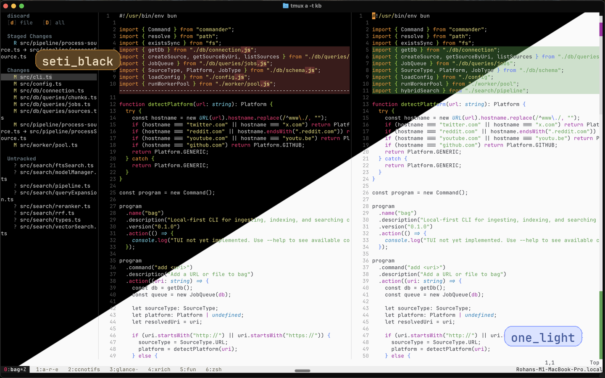

<div align="center">


A standalone Git diff review CLI tool powered by Neovim.

Launch a clean review UI for staged, unstaged, untracked, and conflicted files without touching your existing Neovim setup.

<a href="https://github.com/polyphilz/glance/actions/workflows/ci.yaml" target="_blank"></a>
<a href="https://www.apple.com/macos/" target="_blank"></a>
<a href="https://www.kernel.org/" target="_blank"></a>
<a href="https://neovim.io/" target="_blank"></a>
<a href="https://www.lua.org/" target="_blank"></a>
<a href="LICENSE"></a>

<br>


</div>

## Features

- Standalone launcher that opens Glance in `nvim --clean`, so it does not depend on your plugin manager or existing editor config.
- Single file tree for staged, unstaged, untracked, and conflicted files.
- Side-by-side diffs with a minimap and live file reloads.
- Filetree actions to stage, unstage, or discard one file or the whole repo.
- Safe discard actions for one file or all repo changes, both with confirmation prompts.
- Lua config for theme, layout, keymaps, signs, refresh behavior, and more.

## Quick Start

1. Make sure these runtime dependencies are on your `PATH`:

   - `nvim` `0.11+`
   - `git`

2. Install Glance:

   ```bash
   curl -fsSL https://raw.githubusercontent.com/polyphilz/glance/main/install.sh | bash
   ```

   The installer creates `~/.local/bin/glance`. If `glance` is not found after install, run:

   ```bash
   case ":$PATH:" in
     *":$HOME/.local/bin:"*) echo "~/.local/bin already on PATH" ;;
     *)
       case "${SHELL##*/}" in
         zsh) rc="${ZDOTDIR:-$HOME}/.zshrc" ;;
         bash) rc="$HOME/.bashrc" ;;
         *) rc="$HOME/.profile" ;;
       esac
       line='export PATH="$HOME/.local/bin:$PATH"'
       grep -qxF "$line" "$rc" 2>/dev/null || printf '\n%s\n' "$line" >> "$rc"
       export PATH="$HOME/.local/bin:$PATH"
       echo "Added ~/.local/bin to PATH in $rc"
       ;;
   esac
   ```

3. Optional: create a starter config file:

   ```bash
   glance init-config
   ```

   This writes a starter config to `~/.config/glance/config.lua` by default. If `GLANCE_CONFIG` is set, Glance writes there instead.

4. Run it inside any Git repository:

   ```bash
   cd /path/to/repo
   glance
   ```

Glance launches its own `nvim --clean` session and loads only the bundled runtime. Your existing Neovim config is not required.

## Requirements

| Dependency | Required for | Notes |
| --- | --- | --- |
| macOS or Linux | Running Glance | The launcher and installer assume a Unix-like shell environment. |
| `nvim` `0.11+` | Runtime UI | Must be available on `PATH` as `nvim`. |
| `git` | Repo detection, diffing, stage/unstage/discard actions | Must be available on `PATH` as `git`. |
| Bash, `readlink`, `ln`, `mkdir` | Launcher and install scripts | Standard on typical macOS/Linux setups. |
| `curl`, `tar`, `mktemp` | Bootstrap install via `curl ... \| bash` | Not required when installing from a local checkout. |
| `nvim-treesitter` | Optional richer syntax highlighting | If present in Neovim's standard runtime path, Glance picks it up while running in `--clean` mode. |

<details>
<summary><strong>Install details</strong></summary>

The bootstrap installer resolves the latest GitHub release by default.

Pin a release:

```bash
curl -fsSL https://raw.githubusercontent.com/polyphilz/glance/main/install.sh | GLANCE_REF=v0.1.0 bash
```

Install unreleased `main`:

```bash
curl -fsSL https://raw.githubusercontent.com/polyphilz/glance/main/install.sh | GLANCE_REF=main bash
```

Install from a local checkout:

```bash
./install.sh
```

Verify the installed version:

```bash
glance --version
```

The bootstrap installer downloads Glance into `~/.local/share/glance/<ref>` and creates a symlink at `~/.local/bin/glance`.

Running `./install.sh` from a local checkout creates a symlink at `~/.local/bin/glance` that points back to that checkout. That checkout needs to stay in a stable location after installation.

`~/.local/bin` must be on your `PATH`.

</details>

## Usage

Launch Glance from the root of any Git repo, or from any subdirectory inside it:

```bash
glance
```

Default keys:

| Key | Action |
| --- | --- |
| `<CR>` | Open the selected file |
| `q` | Quit Glance or close the current diff |
| `r` | Refresh the file tree and diff state |
| `J` / `K` | Jump between file tree sections |
| `<Tab>` | Toggle the file tree |
| `s` | Stage the selected file |
| `S` | Stage all supported repo changes |
| `u` | Unstage the selected file |
| `U` | Unstage all supported staged changes |
| `d` | Discard the selected file after confirmation |
| `D` | Discard all repo changes after confirmation |

Pane navigation uses Neovim's built-in window commands by default, so `<C-w><Left>`, `<C-w><Right>`, `<C-w><Up>`, and `<C-w><Down>` work in Glance, along with `<C-w>h/j/k/l`.

## Configuration

Glance loads an optional Lua config file automatically. The most common location is `~/.config/glance/config.lua`, or you can point `GLANCE_CONFIG` at a custom file.

Create a starter config automatically:

```bash
glance init-config
```

If you want to overwrite an existing config file:

```bash
glance init-config --force
```

The config file must `return` a Lua table.

Example:

```lua
return {
  app = {
    hide_statusline = true,
  },
  theme = {
    preset = 'one_light',
  },
  minimap = {
    width = 2,
  },
  windows = {
    filetree = {
      width = 36,
    },
    diff = {
      relativenumber = false,
    },
  },
  filetree = {
    show_legend = false,
  },
}
```

Add custom pane-navigation aliases if you want alternatives to Neovim's built-in `<C-w>` window commands. If your terminal or `tmux` reports those keys as arrows, use the tokens Neovim actually sees:

```lua
return {
  pane_navigation = {
    left = '<Left>',
    down = '<Down>',
    up = '<Up>',
    right = '<Right>',
  },
}
```

These are extra aliases. Glance does not disable Neovim's built-in `<C-w>` window navigation.

## Themes

Glance ships with two built-in theme presets:

- `seti_black`
- `one_light`

`seti_black` is the default. Switch presets with `theme.preset`, and layer `theme.palette` overrides on top when you want to tune individual colors.

```lua
return {
  theme = {
    preset = 'one_light',
  },
}
```

<div align="center">
  
</div>

<details>
<summary><strong>Config reference</strong></summary>

Search order:

1. `$GLANCE_CONFIG`
2. `$XDG_CONFIG_HOME/glance/config.lua`
3. `~/.config/glance/config.lua`

Available top-level config domains:

- `app`
- `theme`
- `windows`
- `filetree`
- `keymaps`
- `pane_navigation`
- `hunk_navigation`
- `signs`
- `welcome`
- `minimap`
- `watch`

Built-in theme presets:

- `seti_black`
- `one_light`

Notes:

- Top-level flat keys like `hide_statusline = true` are not supported. Use the nested schema.
- `theme.preset` selects a built-in palette, and `theme.palette` can override individual colors on top of that preset.
- `welcome.animate` controls whether the welcome screen animation runs.
- `watch.enabled` keeps `.git` metadata watchers on. `watch.poll` controls background worktree polling for new untracked/external file changes.
- Discard actions always prompt for confirmation before changing the repo state.

</details>

<details>
<summary><strong>Troubleshooting</strong></summary>

- **`glance: command not found`**
  `~/.local/bin` is probably not on your `PATH`.

- **`glance: not a git repository`**
  Glance only runs inside a Git work tree.

- **Syntax highlighting looks limited**
  Install `nvim-treesitter` in Neovim's standard runtime path for richer highlighting while Glance runs in `--clean` mode.

</details>

## License

MIT
